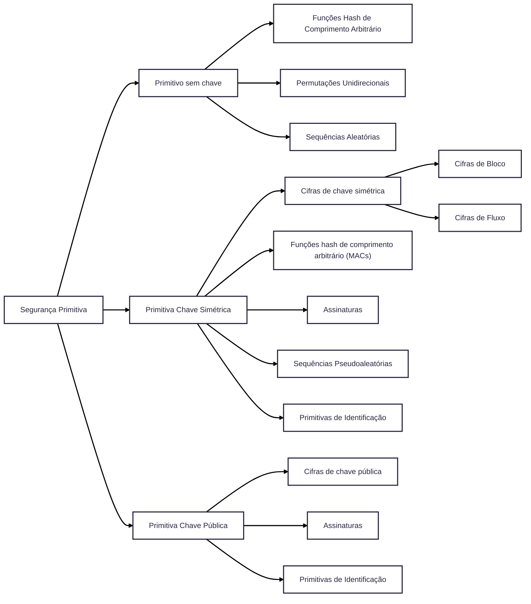

## Diagrama de segurança

```mermaid
---
config:
  theme: redux
---
flowchart LR
    A["Segurança Primitiva"] --> B["Primitivo sem chave"]
    A --> n1["Primitiva Chave Simétrica"]
    A --> n2["Primitiva Chave Pública"]

    B --> C["Funções Hash de Comprimento Arbitrário"]
    B --> D["Permutações Unidirecionais"]
    B --> n3["Sequências Aleatórias"]

    n1 --> n4["Cifras de chave simétrica"]
    n1 --> n5["Funções hash de comprimento arbitrário (MACs)"]
    n1 --> n6["Assinaturas"]
    n1 --> n10["Sequências Pseudoaleatórias"]
    n1 --> n11["Primitivas de Identificação"]

    n2 --> n7["Cifras de chave pública"]
    n2 --> n8["Assinaturas"]
    n2 --> n9["Primitivas de Identificação"]

    n4 --> n12["Cifras de Bloco"]
    n4 --> n13["Cifras de Fluxo"]

```